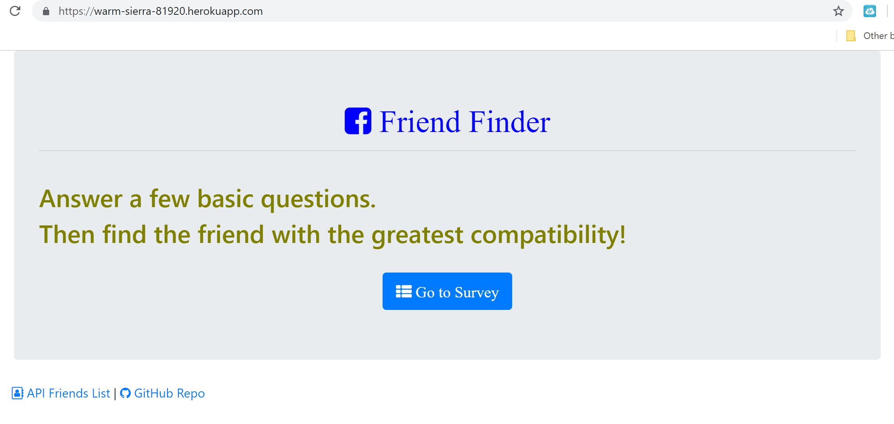
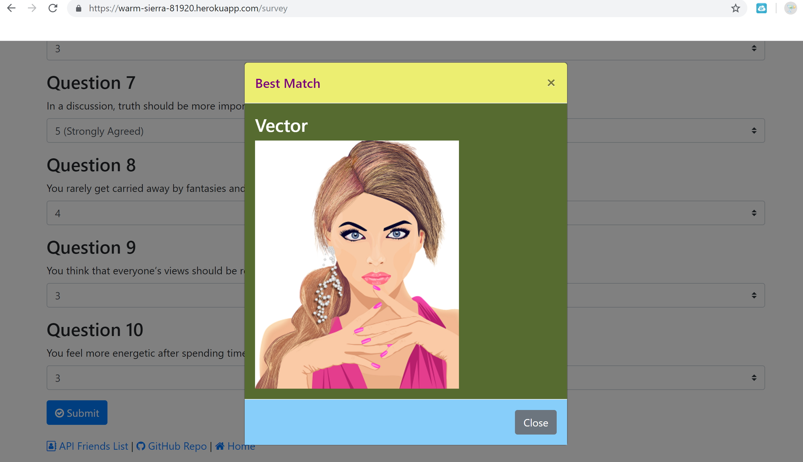
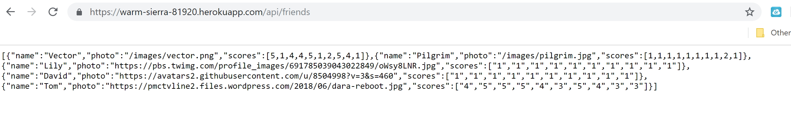

### Friend-Finder

### Overview
A compatibility-based "FriendFinder" application -- basically a dating app. This site will take in results from users' surveys, then compare their answers with those from other users. The app will then display the name and picture of the user with the best overall match.

### App Live Link
https://warm-sierra-81920.herokuapp.com/

### App GitHub Link
https://github.com/helenhao888/Friend-Finder

### Developer
    Developed by Helen Hao (helenhao888)
    
### Technologies
    Node.js 
    Express
    javascript
    jQuery
    HTML
    CSS
    HeroKu/GitHub

### Screenshots
1. Home Page
   From this page, user can click go to survey to navigate the survey page. Click the bottom friends list link will list all the friends information.
   

2. Survey Page
   

3. Friends List 
   

### Contact Information

   Helen Hao :
   :link:[linkedIn](https://www.linkedin.com/in/jinzhao-helen-hao-611b3752/) 
   :link:[Portfolio](https://helenhao888.github.io)    
